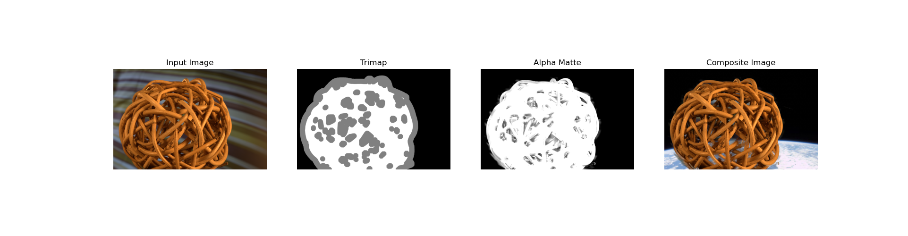

# Bayesian Approach to Digital Matting

## High-level Description of the project
The task at hand involves the utilization of MATLAB and Python implementations to carry out Bayesian Matting [1]. 
**Bayesian matting** : 
Bayesian matting involves loading an input image and its corresponding trimap. The image is partitioned into foreground, background and unknown regions based on pixel opacity values.  We create a window on the boundary of the unknown masks and the weights of the solved foreground and background windows. Also, we generate windows for the same regions in both foreground and background. We can calculate the mean color and covariance matrix for foreground and background if we have enough numbers of them. The 3-equation, 7-variable system is solved to find the maximum likelihhod. updating alpha, foreground and background values. The process is repeated with increasing window size until all pixels are considered.


---

## Installation and Execution

1. For MATLAB no extra library functions are needed to install. 

2. For Python the following files are needed to be installed. 
```sh                                 
matplotlib==3.7.1
numba==0.56.4
numpy==1.23.5
opencv_python==4.7.0.72
Pillow==9.5.0
scikit_image==0.19.3
scikit_learn==1.2.2
skimage==0.0
```

## Methodology and Results
### MATLAB
 For MATLAB just excute demo.m file and provide the necessary path for the images.

 ### Python
 1. ```main_2. py``` : Reads the input image, trimap and the ground truth image. Calculates the alpha matte by call Bayesian_matte_OB and measure the quality metric by calling quality_metric.py. Also calls the compositing.py function to obtain the composite image.
 2. ```Bayesian_matte_OB.py``` : Calculate the alpha matte using maximun likelihood. To determine wheather the unknow region in the trimap is foreground or background.
 3. ```matting_functions.py``` : 
    *  Calculates the Gaussian weights for the window
    *  Generates a window with the unknow pixel as the center
    *  Iteratively solves to obtain alpha matte based on likelihood.
    *  Composites the image 
 4.  ```quality_metrics.py``` : Measures the MSE, SAD, PSNR and Time elapsed.

**Results**


The table presents quantitative metrics for low-resolution images with two different trimaps, Trimaps 1 and 2. The metrics used to evaluate the quality of the results are mean squared error (MSE), sum of absolute differences (SAD), peak signal-to-noise ratio (PSNR), structural similarity index (SSIM), and time taken to produce the results.

The results show that for each ground truth image (GT), the performance of the algorithm varies with the type of trimap used. In general, the use of Trimap 1 results in better performance, as seen in the lower MSE, SAD, and higher PSNR and SSIM values compared to Trimap 2. However, the time taken for Trimap 1 is higher than Trimap 2.

When comparing the performance of the algorithm for different ground truth images, we can observe that images with a natural 3D background (GT24, GT25, GT26, GT27) generally have higher MSE, SAD, and lower PSNR and SSIM values compared to images with natural scenes (GT01, GT02, GT04, GT08, GT09, GT14, GT15). This could be because the natural 3D background makes it more challenging for the algorithm to perform the matting task accurately.

Overall, the results suggest that the algorithm performs better for natural scenes with a simple background and the use of Trimap 1 results in better performance but at a higher computational cost.


For high-resolution images, the results are shown only for Trimaps 1. It can be seen that the MSE and SAD values for all the high-resolution images are significantly higher than those for low-resolution images, indicating that processing high-resolution images is more challenging. The time taken for processing high-resolution images is also much higher than that for low-resolution images.

Overall, the results suggest that the performance of the image processing techniques is highly dependent on the resolution and complexity of the images.

* Sensitivity:
We observe that we will get better matting results with much more refined trimaps with less MSE values. The MSE values generated using trimap 1 are considerably less than MSE error generated by trimap 2. This shows that the finer trimap gives better mattes with Bayesian matting algorithm.


* Gradient error:
Gradient errors are due to oversmoothing or erroneous discontinuities in the alpha matte (i.e. the gradient in the alpha matte diverges from the ground truth). Higher gradient error indicates that there is oversmoothening of the edges in the alpha matte when compared to the ground truth. Therefore the lesser the gradient error the better the quality of alpha matte.[2]. The difference between the gradients of the computed alpha matte α and its ground truth α∗ is defined as the absolute difference between the normalized gradients of the alpha mattes at pixel i that we
computed by convolving the mattes with first-order Gaussian derivative filters with variance σ. For these values we have taken the value of variance to be 0.5.


Following are some of the output obtain.(Images are taken from alphamatting.com)


Result obtain when salt and pepper noise is added to the image.


Results for Test images

* Low Transparent Image


* Strongly Transparent Image


* High Transparent Image


**Silcing :**
```Four_section.py``` provides an analysis of tiled images in four sections. It has been observed that this method takes half the time compared to not slicing the image, but the PSNR drops by approximately 3dB in this case

   

   

**Unit Test**


*   test_image_and_alpha_size: This test checks if the input image and the alpha mask have the same dimensions. If they don't, the test fails.
*   test_window_size_is_odd: This test checks if a variable called N is an odd number. If it is even, the test fails.
*   test_images: This test checks if three example images have been loaded successfully and have the same size. If any of the images is not loaded or has a different size than the others, the test fails.
*   test_calc_total_weight: This test checks if a function called calc_total_weight returns the correct sum of weights for a given array of weights. If the function doesn't return the expected value, the test fails.
*   test_calc_mean: This test checks if a function called calc_mean returns the correct weighted mean for a given array of data and weights. If the function doesn't return the expected value, the test fails.
*   test_output_shape: This test checks if a function called matlab_style_gauss2d returns a filter of the expected shape for a given set of inputs. If the function doesn't return the expected shape, the test fails.
*   test_sum_is_one: This test checks if a filter returned by the matlab_style_gauss2d function has a sum of 1.0 (within a small tolerance). If the sum is not 1.0, the test fails.
*   test_symmetry: This test checks if a filter returned by the matlab_style_gauss2d function is symmetric (i.e., equal to its mirror image). If the filter is not symmetric, the test fails


---
## Credits

[1] Chuang, Y.Y., Curless, B., Salesin, D.H. and Szeliski, R., 2001, December. A bayesian approach to digital matting. In Proceedings of the 2001 IEEE Computer Society Conference on Computer Vision and Pattern Recognition. CVPR 2001 (Vol. 2, pp. II-II). IEEE.
[2] C. Rhemann, C. Rother, J. Wang, M. Gelautz, P. Kohli, P. Rott: "A Perceptually Motivated Online Benchmark for Image Matting"; Poster: IEEE Conference on Computer Vision and Pattern Recognition, 2009. CVPR '09, Miami, Florida, USA; 06-20-2009 - 06-25-2009; in: "Proceddings of the IEEE Conference on Computer Vision and Pattern Recognition", (2009), 8 pages.


